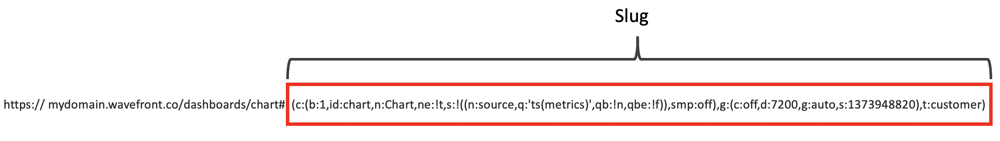

# Wavefront Slug Rison Generator
This library generates [Rison](https://rison.io/#:~:text=What%20is%20Rison,metaweb(acquired%20by%20google))
slugs for Wavefront charts. With it, you can compose a new chart URL by:
* Using the provided `SlugBuilder` to create a new chart slug.
* Combining the Wavefront hostname and the new chart slug.

Example:


## Table of Content
* [Prerequisites](#prerequisites)
* [Usage](#usage)
   * [Get Wavefront Hostname](#1-get-wavefront-hostname)
   * [Generate Chart Slug](#2-generate-chart-slug)
   * [Generate Chart URL](#3-generate-chart-url)
* [License](#license)

## Prerequisites
* Java 11 or above
* If you are using Maven, add the following dependency:
    ```xml
    <dependency>
      <groupId>com.wavefront</groupId>
      <artifactId>slug-generator</artifactId>
      <version>$releaseVersion</version>
    </dependency>
    ```
    Replace `$releaseVersion` with the latest version available on [nexus](https://repo.wavefront.com/#welcome).
* If you are using Gradle, add the following dependency:
    ```groovy
    dependencies {
    // Pick one:

    // 1. Use slug generator in your implementation only:
        implementation("com.wavefront:slug-generator:$releaseVersion")

    // 2. Use slug generator in your public API:
        api("com.wavefront:slug-generator:$releaseVersion")
    }
    ```
    Replace `$releaseVersion` with the latest version available on [nexus](https://repo.wavefront.com/#welcome).

## Usage
Follow these steps to generate a valid Wavefront chart URL:

#### 1. Get the Wavefront Hostname
The hostname is the Wavefront cluster or instance name. The examples in this guide use `mydomain
.wavefront.com`.

#### 2. Generate the Chart Slug
A chart slug describes the structure of the chart in Wavefront. It is included in the chart URL
when you open a Wavefront chart on your browser.  
The example given below creates the following slug:  
`(c:(b:1,id:chart,n:Chart,ne:!t,s:!((n:source,q:'ts(metrics)',qb:!n,qbe:!f)),smp:off),g:(c:off,d:7200,g:auto,s:1373948820),t:customer)`

Example:
```java
import com.wavefront.slug.SlugBuilderImpl;
// Plain String
// result: (c:(b:1,id:chart,n:Chart,ne:!t,s:!((n:source,q:'ts(metrics)',qb:!n,qbe:!f)),smp:off),g:(c:off,d:7200,g:auto,s:1373948820),t:customer)
String slug = new SlugBuilderImpl()
    .setCustomerId("customer")
    .setStart(new DateTime(2013, 7, 16, 4, 27, DateTimeZone.UTC))
    .setEnd(new DateTime(2013, 7, 16, 6, 27, DateTimeZone.UTC))
    .addSource("source", "ts(metrics)")
    .build();
```

#### 3. Generate the Chart URL
Use the `UriBuilder` and `UrlEscapers` to combine the Wavefront hostname with the chart slug you
generated in the previous step.
```java
import javax.ws.rs.core.UriBuilder;
import com.google.common.net.UrlEscapers;
String baseUrl = UriBuilder.fromUri("https://mydomain.wavefront.com/chart").build().toString();

// follow the Chart Slug section below to check how to generate a slug
// java is bad at escaping url :)
String escapedFragment = "#" + UrlEscapers.urlFragmentEscaper().escape(slug);

// result: https://mydomain.wavefront.com/chart#(c:(b:1,id:chart,n:Chart,ne:!t,s:!((n:source,q:'ts(metrics)',qb:!n,qbe:!f)),smp:off),g:(c:off,d:7200,g:auto,s:1373948820),t:customer)
String fullUrl = baseUrl + escapedFragment;
```

## License
This code is under the [Apache Licence v2](LICENSE).

## How to Contribute
* Reach out to us on our public [Slack channel](https://www.wavefront.com/join-public-slack).
* If you run into any issues, let us know by creating a GitHub issue.
